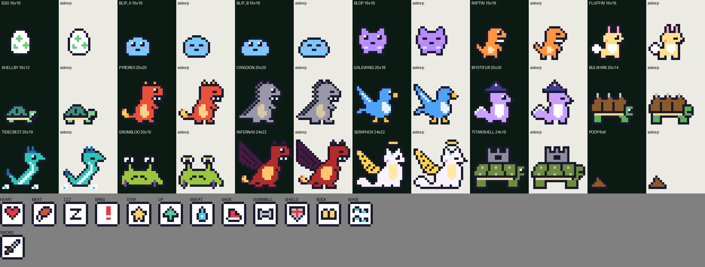

# Desklings

A tiny Digimon / Monster Rancher–style pet that lives on your Windows taskbar. Feed it, train it, battle wild monsters, and steer it down one of several evolution paths. When its life runs out it retires to the Hall of Fame, and its egg carries some of its strength into the next generation.

It's a single ~200 KB native executable written in Rust against raw Win32 APIs. It uses about 1.5 MB of private memory.



## Download

Grab `desklings.exe` from the [latest release](https://github.com/AndruC/desklings/releases/latest) and run it. There's no installer. To have it start with Windows, put a shortcut in `shell:startup`.

The exe isn't code-signed, so Windows SmartScreen may warn you the first time. Click **More info → Run anyway**.

## Features

- **Lives on your taskbar.** Always on top. Clicks pass through the transparent parts, and it never takes focus from your work. Drag it anywhere, even to another monitor, and it drops back down. Pixel art is scaled in whole pixels to your main display's DPI, so it stays crisp there (a second monitor with a different scale setting may show it slightly soft).
- **Needs:** hunger, happiness and energy. It poops a few minutes after eating, and the poop stays where it was dropped. Click a poop to clean it up.
- **Stats:** Life, Power, Defense, Speed and Wisdom, each up to 999.
- **Training:** five drills (Run, Lift, Endure, Study, Swim). Happy monsters train better, unhappy ones slack off, and sometimes you get a *Great!* session.
- **Battles:** a wild monster walks up and the two auto-battle with HP bars. Win to climb ranks E→S.
- **Evolution:** 16 species across Egg → Fresh → In-Training → Rookie → Champion → Ultimate. The path depends on which stats you train, how well you look after it, and how many battles it has won.
- **Lifespan and retirement:** a monster starts with two weeks to live. Every day without a care mistake adds half a day, so a well-kept monster lives up to about four weeks. Care mistakes and overwork shorten it. Days with the app closed count as good days, so closing it for a while is never punished. Retirees enter the Hall of Fame, and the next egg inherits a tenth of their stats.
- **Saves automatically** to `%APPDATA%\desklings\`. While it's closed, needs drain gently and never fall below a safe minimum.

## Evolution tree

```
Egg → Blip → Blop ─┬─ Raptin  (Power)          ─┬─ Pyrorex   (Power ≥ Defense)  ─┐
                   │                            └─ Cragdon   (Defense > Power)  ─┴─ Infernax
                   ├─ Fluffin (Speed / Wisdom)  ─┬─ Galewing  (Speed ≥ Wisdom)  ─┐
                   │                            └─ Mystifur  (Wisdom > Speed)   ─┴─ Seraphox
                   └─ Shellby (Defense / Life)  ─┬─ Bulwark   (Defense ≥ Life)  ─┐
                                                └─ Tidecrest (Life > Defense)   ─┴─ Titanshell

Any Rookie with 5+ care mistakes or under 150 total stats → Grumbloo
```

| Stage | Reached after | Notes |
|---|---|---|
| Fresh | 1 minute | Hatches |
| In-Training | 10 minutes | Can battle from here |
| Rookie | 1 hour | Branch chosen by its best stat |
| Champion | 1 day | Branch chosen by stats; bad care → Grumbloo |
| Ultimate | 2+ days | Needs 500+ total stats, 5+ wins, ≤ 3 care mistakes |

A **care mistake** is letting it starve, letting its happiness hit zero, or letting poop pile up past three.

## Controls

| Action | What it does |
|---|---|
| Left-click | Pet it |
| Drag | Pick it up and move it |
| Right-click | Stats and actions: Feed, Train, Battle, Play, Clean up, Lights out, Evolution guide, Hall of Fame, Retire, Start over, Quit |
| Click a poop | Clean it up |

## Building

Requires Windows and a Rust toolchain (stable, 2021 edition).

```sh
cargo build --release
target\release\desklings.exe
cargo test   # game-rule unit tests
```

Only one copy runs at a time. To start it with Windows, put a shortcut to the exe in `shell:startup`.

## Project layout

| Path | Contents |
|---|---|
| `src/main.rs` | Windows, rendering, animation, input, menus, training and battle scenes |
| `src/monster.rs` | Species table, evolution rules, training and battle maths (no Windows code; unit tested) |
| `src/pet.rs` | The pet's state, lifespan, save file and Hall of Fame |
| `src/sprites.rs` | All pixel art as text grids |
| `tools/sprite_sheet.py` | Validates the sprites and renders `docs/sprites.png` (needs Pillow) |

## Save files

Saves live in `%APPDATA%\desklings\`:

- `state.txt` is the current pet, as plain `key=value` lines.
- `halloffame.txt` has one line per retired monster.

Delete `state.txt` to start completely fresh.

## License

MIT. See [LICENSE](LICENSE).
